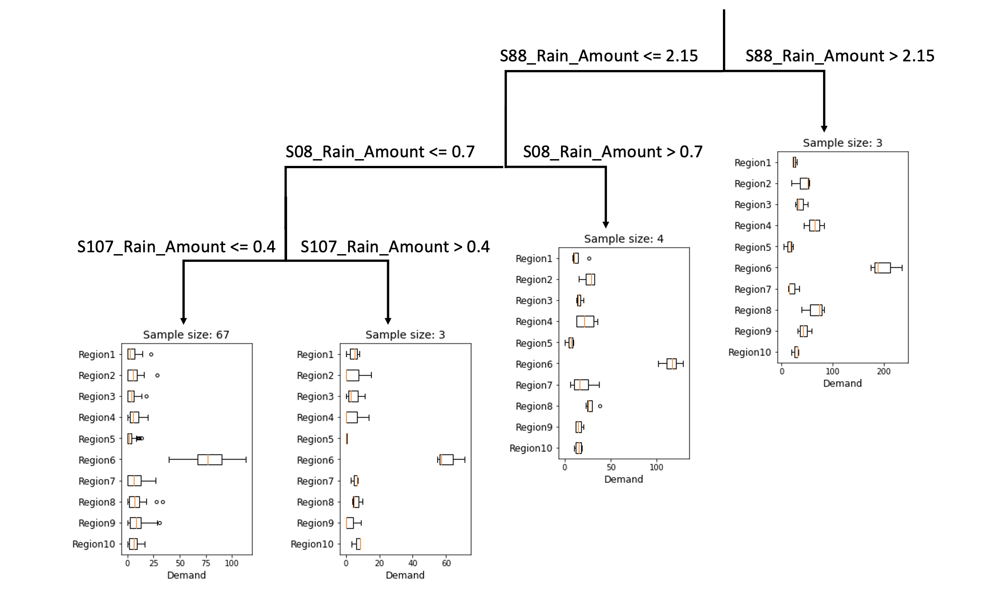

<script src="https://cdn.mathjax.org/mathjax/latest/MathJax.js?config=TeX-AMS-MML_HTMLorMML" type="text/javascript"></script>

### Robust vehicle pre-allocation with uncertain covariates

In this example,  we consider the vehicle pre-allocation problem introduced in [Hao et al. (2020)](#ref1). Suppose that there are \\(I\\) supply nodes and \\(J\\) demand nodes in an urban area.  The operator,  before the random demand \\(\tilde{d}\_j = (\tilde{d})\_{j\in[J]}\\) realizes, allocates \\(x_{ij}\\) vehicles from supply node \\(i\in[I]\\) (which has a numbers \\(i\\) of idle vehicles) to demand node \\(j\in[J]\\) at a unit cost \\(c_{ij}\\), and the revenue is calculated as \\(\sum_{j \in [J]} r_j \min\\left\\{\sum_{i \in [I]} x_{ij}, d_j\\right\\}\\), as the uncertain demand is realized. Consider the demand randomness, the distributionally robust vehicle pre-allocation problem can be formulated as the following problem:

$$
\begin{align}
\min~&\sum\limits_{i\in[I]}\sum\limits_{j\in[J]}(c_{ij} - r_j)x_{ij} + \sup\limits_{\mathbb{P}\in\mathcal{F}}\mathbb{E}_{\mathbb{P}}\left[\sum\limits_{j\in[J]}r_jy_j(\tilde{s}, \tilde{\pmb{d}}, \tilde{\pmb{u}})\right] \hspace{-1.5in}&& \\
\text{s.t.}~&y_j(s, \pmb{d}, \pmb{u}) \geq \sum\limits_{i\in[I]}x_{ij} - d_j && \forall (\pmb{d}, \pmb{u}) \in \mathcal{Z}_s, \forall s \in [S], \forall j \in [J] \\
&y_j(s, \pmb{d}, \pmb{u}) \geq 0 && \forall (\pmb{d}, \pmb{u}) \in \mathcal{Z}_s, \forall s \in [S], \forall j \in [J] \\
&\sum\limits_{j\in[J]}x_{ij} \leq q_i && \forall i \in [I] \\
&x_{ij} \geq 0 &&\forall i \in[I], \forall j \in [J], \\
\end{align}
$$

where \\(y_j(s, \pmb{d}, \pmb{u})\\) is the adaptive decision representing the demand surplus and it adapts to each scenario and affinely depends on random variables \\(\pmb{d}\\) and \\(\pmb{u}\\), as a tractable approximation of the non-anticipative decisions. Following the work done by [Hao et al. (2020)](#ref1), model parameters are summarized as follows:
- Number of supply nodes \\(I=1\\);
- Number of demand nodes \\(J=10\\);
- Coefficients \\(\hat{\pmb{r}} = (15.0,14.1,6.1,14.9,13.8,15.8,15.3,16.4,15.8,13.2)\\);
- Revenue coefficients \\(r_j = 0.1\hat{r}_j + 3\\), where \\(j=1, 2, ..., J\\);
- Cost coefficients \\(c_j = 3\\), where \\(j=1, 2, ..., J\\);
- Maximum supply of vehicles \\(q_i=400\\), where \\(i=1, 2, ..., I\\).

The ambiguity set \\(\mathcal{F}\\) presented below considers the conditional means and variances of \\(S\\) scenario,

$$
\begin{align}
\mathcal{F} = \left\{
\mathbb{P}\in\mathcal{P}_0(\mathbb{R}^J\times\mathbb{R}^J\times [S]) \left|
\begin{array}{ll}
(\tilde{\pmb{d}}, \tilde{\pmb{u}}, \tilde{s}) \in \mathbb{P} & \\
\mathbb{E}_{\mathbb{P}}[\tilde{\pmb{d}}|\tilde{s}=s] = \pmb{\mu}_s & \forall s \in [S] \\
\mathbb{E}_{\mathbb{P}}[\tilde{\pmb{u}}|\tilde{s}=s] = \pmb{\phi}_s & \forall s \in [S] \\
\mathbb{P}[(\tilde{\pmb{d}}, \tilde{\pmb{u}}) \in \mathcal{Z}_s | \tilde{s}=s] = 1 & \forall s \in [S] \\
\mathbb{P}[\tilde{s}=s] = w_s & \forall s \in [S] \\
\end{array}
\right.
\right\}.
\end{align}
$$

The scenarios and parameters of the ambiguity sets are identified based on the dataset dataset [taxi_rain.csv](taxi_rain.csv) where the first ten columns are the taxi demand data for ten regions, and the remaining columns are corresponding side information in terms of rainfall records. Please note that the dataset is slightly different from the data used by [Hao et al. (2020)](#ref1) as some small random noises are added to the demand data. We use a multivariate regression tree to generate \\(S\\) scenarios (leaf nodes of the tree) and the conditional means and variances for each scenario are calculated respectively. The code is provided as follows.

```python
import pandas as pd
from sklearn.tree import DecisionTreeRegressor

data = pd.read_csv('taxi_rain.csv')
D, V = data.iloc[:, :10], data.iloc[:, 10:]         # D: demand & V: side info.

regr = DecisionTreeRegressor(max_leaf_nodes=4,      # max leaf nodes
                             min_samples_leaf=3)    # min sample size of each leaf
regr.fit(V, D)

mu, index, counts = np.unique(regr.predict(V), axis=0,
                              return_inverse=True,
                              return_counts=True)   # mu as the conditional mean

w = counts/V.shape[0]                               # scenario weights         
phi = np.array([(D.values[index==i] - mu[i]).std(axis=0)
                for i in range(len(counts))])       # conditional variance
d_ub = np.array([D.values[index==i].max(axis=0)
                 for i in range(len(counts))])      # upper bound of each scenario
d_lb = np.array([D.values[index==i].min(axis=0)
                 for i in range(len(counts))])      # lower bound of each scenario
```

The structure of the tree is displayed by the following diagram, as an example of four leaf nodes where the minimum sample size for each node is three.



By exploiting the moment information of each leaf node, we can formulate the model by the following code segment.

```python
from rsome import dro
from rsome import square
from rsome import E
from rsome import grb_solver as grb
import numpy as np

J = 10
I = 1
rhat = np.array([15.0, 14.1, 6.1, 14.9, 13.8, 15.8, 15.3, 16.4, 15.8, 13.2])
b = 3 * np.ones(J)
r = 0.1*rhat + b
c = np.zeros((I, J)) + b
q = 400 * np.ones(I)

S = mu.shape[0]                             # the number of leaf nodes (scenarios)
model = dro.Model(S)                        # create a model with S scenarios

d = model.rvar(J)
u = model.rvar(J)
fset = model.ambiguity()
for s in range(S):
    fset[s].exptset(E(d) == mu[s],
                    E(u) <= phi[s])         # conditional expectation
    fset[s].suppset(d >= d_lb[s], d <= d_ub[s],
                    square(d - mu[s]) <= u) # support of each scenario
pr = model.p                                # scenario weights
fset.probset(pr == w)                       # w as scenario weights

x = model.dvar((I, J))
y = model.dvar(J)
y.adapt(d)
y.adapt(u)
for s in range(S):
    y.adapt(s)                              # y adapts to each scenario s

model.minsup(((c - r)*x).sum() + E(r@y), fset)
model.st(y >= x.sum(axis=0) - d, y >= 0)
model.st(x >= 0, x.sum(axis=0) <= q)

model.solve(grb)
```

```
Being solved by Gurobi...
Solution status: 2
Running time: 0.0591s
```

<br>

#### Reference

<a id="ref1"></a>

Hao, Zhaowei, Long He, Zhenyu Hu, and Jun Jiang. "[Robust vehicle pre‐allocation with uncertain covariates]((https://onlinelibrary.wiley.com/doi/abs/10.1111/poms.13143))." <i>Production and Operations Management</i> 29.4 (2020): 955-972.
