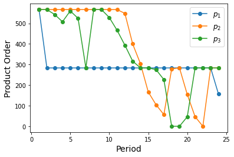

<script src="https://cdn.mathjax.org/mathjax/latest/MathJax.js?config=TeX-AMS-MML_HTMLorMML" type="text/javascript"></script>

### Joint Production-Inventory

In this example, we considered the robust production-inventory problem introduced in [Ben-Tal et al. (2004)](#ref1). The formulation of the robust model is given below,

$$
\begin{align}
\min~&\max\limits_{\pmb{d}\in \mathcal{Z}}\sum\limits_{t=1}^{24}\sum\limits_{i=1}^3c_{it}p_{it}(\pmb{d}) &&\\
\text{s.t.}~&0 \leq p_{it}(\pmb{d}) \leq P_{it}, && i= 1, 2, 3; t = 1, 2, ..., 24 \\
&\sum\limits_{i=1}^{\top}p_{it}(\pmb{d}) \leq Q_i, && i = 1, 2, 3 \\
& v_{\min} \leq v_0 + \sum\limits_{\tau=1}^{t-1}\sum\limits_{i=1}^3p_{i\tau} - \sum\limits_{\tau=1}^{t-1}d_{\tau} \leq v_{\max}, && t = 1, 2, ..., 24,
\end{align}
$$

with random variable \\(d_t\\) representing the uncertain product demand during the period \\(t\\), and the recourse decision variable \\(p_{it}(\pmb{d})\\) indicating the product order of the \\(i\\)th factory during the period \\(t\\), where \\(i=1, 2, 3\\), and \\(t=1, 2, ..., 24\\). Parameters of the problem are:

- Production cost: \\(c_{it}  = \alpha_i\left(1+\frac{1}{2}\sin\left(\frac{\pi(t-1)}{12}\right)\right),~\text{where }\alpha_1 = 1, \alpha_2 = 1.5, \alpha_3 = 2 \\)
- Nominal demand: \\({d}_t^0 = 1000\left(1 + \frac{1}{2}\sin\left(\frac{\pi(t-1)}{12}\right)\right)\\)
- The maximum production capacity of factory \\(i\\): \\(P_{it} = 567\\)
- The maximum total production capacity of the \\(i\\)th factory throughout all periods: \\(Q_i = 13600\\)
- The minimum allowed level of inventory at the warehouse: \\(v_{\min}=500\\)
- The maximum storage capacity of the warehouse: \\(v_{\max}=2000\\)
- The initial level of inventory: \\(v_0=500\\).

The code segment below imports RSOME and defines parameters mentioned above.

```python
from rsome import ro
import numpy as np

T = 24
t = np.arange(1, T+1)
d0 = 1000 * (1 + 0.5*np.sin(np.pi*(t-1)/12))
alpha = np.array([1, 1.5, 2]).reshape((3, 1))
c = alpha * (1 + 0.5*np.sin(np.pi*(t-1)/12))

P = 567
Q = 13600
vmin = 500
vmax = 2000
v = 500
theta = 0.2
```

It is assumed that the random demand is within a box uncertainty set

$$
\mathcal{Z}=\prod\limits_{t=1}^{24}[{d}_t^0 - \theta {d}_t^0, {d}_t^0 + \theta {d}_t^0].
$$

and in the adaptive robust optimization framework, the recourse decision \\(\pmb{p}(\pmb{d})\\) is approximated by the expression \\(p_{it}(\pmb{d}) = p_{it}^0 + \sum_{\tau\in [t-1]}p_{it}^{\tau} d_{\tau}\\), <i>i.e.</i>, the affine decision rule \\(p_{it}\in\mathcal{L}([t-1])\\). The robust model can be then implemented by the code below.

```python
model = ro.Model()

d = model.rvar(T)
uset = (d >= (1-theta)*d0, d <= (1+theta)*d0)

p = model.ldr((3, T))              # define p as affine decision rule
for t in range(1, T):
    p[:, t].adapt(d[:t])           # adaptation of the decision rule

model.minmax((c*p).sum(), uset)    # worst-case objective
model.st(0 <= p, p <= P)
model.st(p.sum(axis=1) <= Q)
for t in range(T):
    model.st(v + p[:, :t+1].sum() - d[:t+1].sum() >= vmin)
    model.st(v + p[:, :t+1].sum() - d[:t+1].sum() <= vmax)

model.solve()
```

```
Being solved by the default LP solver...
Solution status: 0
Running time: 1.0346s
```

The worst-case total cost is represented by the variable `wc_cost`, as shown below.

```python
wc_cost = model.get()
wc_cost
```

```
44272.827493119396
```

We may further investigate the decision rule \\(p_{it}(\pmb{d})\\) under given values of the random demand \\(\pmb{d}\\). For example, the code below visualizes the values of product orders under the nominal demand \\(\pmb{d}_0\\). 

```python
import matplotlib.pyplot as plt

p_nomial = p(d.assign(d0))
plt.plot(np.arange(1, T+1), p_nomial.T, 
         marker='o', label=[r'$p_1$', r'$p_2$', r'$p_3$'])
plt.legend(fontsize=12)
plt.xlabel('Period', fontsize=14)
plt.ylabel('Product Order', fontsize=14)
plt.show()
```




It is demonstrated in [de Ruiter et al. (2016)](#ref2) that there could be multiple optimal solutions for this robust production-inventory problem. All of these optimal robust solutions have the same worst-case objective value, but the affine decision rule \\(\pmb{p}(\pmb{d})\\) could be greatly vary, leading to very different performance under non worst-case realizations. For example, if different solvers are used to solve the robust model above, solutions for \\(\pmb{p}(\pmb{d})\\) could be quite different.

Here we follow the steps introduced in [de Ruiter et al. (2016)](#ref2) to find a Pareto robustly optimal solution: change the objective into minimizing the cost for the nominal demand trajectory. Furthermore, add a constraint that ensures that the worst-case costs do not exceed the worst-case cost found in the robust model above. Please note that the nominal objective can be equivalently written as the worst-case cost over an uncertainty set \\(\mathcal{Z}_0=\\left\\{\pmb{d}^0\\right\\}\\), i.e., enforcing \\(\pmb{d}\\) to be the same as the nominal trajectory. The code is given below to find the Pareto robustly optimal solution.

```python
model = ro.Model()

d = model.rvar(T)
uset = (d >= (1-theta)*d0, d <= (1+theta)*d0)      # budget of uncertainty
uset0 = (d == d0,)                                 # nominal case uncertainty set

p = model.ldr((3, T))
for t in range(1, T):
    p[:, t].adapt(d[:t])

model.minmax((c*p).sum(), uset0)                   # the nominal objective
model.st(((c*p).sum() <= wc_cost).forall(uset))    # the worst-case objective
model.st((0 <= p).forall(uset))
model.st((p <= P).forall(uset))
model.st((p.sum(axis=1) <= Q).forall(uset))
for t in range(T):
    model.st((v + p[:, :t+1].sum() - d[:t+1].sum() >= vmin).forall(uset))
    model.st((v + p[:, :t+1].sum() - d[:t+1].sum() <= vmax).forall(uset))

model.solve()
```

```
Being solved by the default LP solver...
Solution status: 0
Running time: 0.3694s
```
The objective value is the total production cost under the nominal demand trajectory.

```python
nom_cost = model.get()
nom_cost
```

```
35076.73675839579
```

Please refer to Table 1 of [de Ruiter et al. (2016)](#ref2) to verify the worst-case and nominal production costs.

<br>

#### Reference

<a id="ref1"></a>

Ben-Tal, Aharon, Alexander Goryashko, Elana Guslitzer, and Arkadi Nemirovski. 2004. [Adjustable robust solutions of uncertain linear programs](https://www2.isye.gatech.edu/~nemirovs/MP_Elana_2004.pdf). <i>Mathematical Programming</i> <b>99</b>(2) 351-376.

<a id="ref2"></a>
de Ruiter, Frans JCT, Ruud CM Brekelmans, and Dick den Hertog. 2016. [The impact of the existence of multiple adjustable robust solutions](https://link.springer.com/article/10.1007/s10107-016-0978-6). <i>Mathematical Programming</i> <b>160</b>(1) 531-545.
