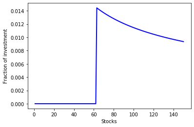

<script src="https://cdn.mathjax.org/mathjax/latest/MathJax.js?config=TeX-AMS-MML_HTMLorMML" type="text/javascript"></script>

### Robust portfolio optimization

In this example, the portfolio construction problem discussed in the previous sections is solved by a robust optimization approach introduced in the paper [Bertsimas and Sim (2004)](#ref1). The robust model is presented below.

$$
\begin{align}
\max~&\min\limits_{\pmb{z}\in\mathcal{Z}} \sum\limits_{i=1}^n\left(p_i + \delta_iz_i \right)x_i \\
\text{s.t.}~&\sum\limits_{i=1}^nx_i = 1 \\
&x_i \geq 0, ~\forall i = 1, 2, ..., n,
\end{align}
$$

where the affine term \\(p_i + \delta_iz_i\\) represents the random stock return, and the random variable is between \\([-1, 1]\\), so the stock return has an arbitrary distribution in the interval \\([p_i - \delta_i, p_i + \delta_i]\\). The uncertainty set \\(\mathcal{Z}\\) is given below,

$$
\begin{align}
\mathcal{Z} = \left\{\pmb{z}: \|\pmb{z}\|_{\infty} \leq 1, \|\pmb{z}\|_1 \leq \Gamma\right\},
\end{align}
$$

where \\(\Gamma\\) is the budget of uncertainty parameter. Values of the budget of uncertainty and other parameters are presented as follows.

$$
\begin{align}
& \Gamma = 5 &\\
& p_i = 1.15 + i\frac{0.05}{150}, &\forall i = 1, 2, ..., n \\
& \delta_i = \frac{0.05}{450}\sqrt{2in(n+1)}, &\forall i = 1, 2, ..., n.
\end{align}
$$

The robust optimization model can be implemented by the following Python code.


```python
from rsome import ro
from rsome import grb_solver as grb
import rsome as rso
import numpy as np


n = 150                                 # number of stocks
i = np.arange(1, n+1)                   # indices of stocks
p = 1.15 + i*0.05/150                   # mean returns
delta = 0.05/450 * (2*i*n*(n+1))**0.5   # deviations of returns
Gamma = 5                               # budget of uncertainty

model = ro.Model()              
x = model.dvar(n)                       # fractions of investment
z = model.rvar(n)                       # random variables

model.maxmin((p + delta*z) @ x,         # the max-min objective
             rso.norm(z, np.infty) <=1, # uncertainty set constraints
             rso.norm(z, 1) <= Gamma)   # uncertainty set constraints
model.st(sum(x) == 1)                   # summation of x is one
model.st(x >= 0)                        # x is non-negative

model.solve(grb)                        # solve the model by Gurobi
```

    Being solved by Gurobi...
    Solution status: 2
    Running time: 0.0038s


The optimal investment decision can be visualized by the diagram below.


```python
import matplotlib.pyplot as plt

obj_val = model.get()                   # the optimal objective value
x_sol = x.get()                         # the optimal investment decision

plt.plot(range(1, n+1), x_sol,
         linewidth=2, color='b')
plt.xlabel('Stocks')
plt.ylabel('Fraction of investment')
plt.show()
print('Objective value: {0:0.4f}'.format(obj_val))
```





    Objective value: 1.1709

<br>
#### Reference

<a id="ref1"></a>

Bertsimas, Dimitris, Melvyn Sim. 2004. [The price of robustness](https://pubsonline.informs.org/doi/abs/10.1287/opre.1030.0065) <i>Operations research</i> <b>52</b>(1) 35–53.
