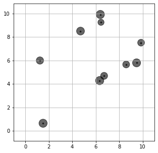
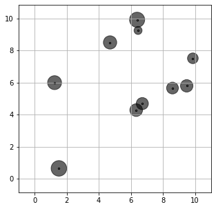
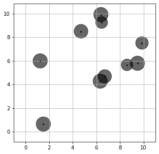
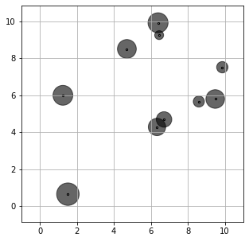

<script src="https://cdn.mathjax.org/mathjax/latest/MathJax.js?config=TeX-AMS-MML_HTMLorMML" type="text/javascript"></script>

### Distributionally robust optimization approaches for a lot-sizing problem

In this section, we are using RSOME to replicate numerical case studies presented in [Bertsimas et al. (2021)](#ref1). A capacitated network with \\(n\\) locations is considered, where each location \\(i\\) has an unknown demand \\(d_i\\), and the demand can be satisfied by the existing local stock \\(x_i\\) or by transporting an amount \\(y_{ij}\\) of units from another location \\(j\\), which is determined after the demand is realized. Such a lot-sizing problem can be written as the following two-stage formulation,

$$
\begin{align}
\min~& \sum\limits_{i=1}^Nc_ix_i + \mathbb{E}\left[Q(\pmb{x}, \tilde{\pmb{d}})\right], \\
\text{s.t.}~ &0 \leq x_i \leq K, & i = 1, 2, ..., n
\end{align}
$$

where the recourse problem \\(Q(\pmb{x}, \pmb{d})\\) is written as

$$
\begin{align}
Q(\pmb{x}, \pmb{z}) = \min~& \sum\limits_{i=1}^n\sum\limits_{j=1}^nc_{ij}y_{ij} &\\
\text{s.t.}~&x_i - \sum\limits_{j=1}^Ny_{ji} + \sum\limits_{j=1}^Ny_{ij} \geq d_i & i = 1, 2, ..., n \\
&\pmb{0} \leq \pmb{y} \leq \pmb{b}.
\end{align}
$$

Parameters of the case studies are given below:
- The number of locations: \\(n=10\\)
- Cost of local stock: \\(a_i=1\\), \\(i=1, 2, ..., n\\)
- Cost of shipping units: \\(c_{ij}\\) is the Euclidean distance between location \\(i\\) and \\(j\\).
- Stock capacity: \\(K=20\\)
- Transportation capacity: \\(b_{ij}=K/(n-1)u_{ij}\\), where each \\(u_{ij}\\) is a random variable generated from a standard uniform distribution.
- Sample size of the training set: \\(N=20\\)
- Robustness parameter: \\(\epsilon=10N^{-1/10}\\)

```python
n = 10
a = 1
K = 20

b = K / (n-1) / rd.rand(n, n)

xy = 10*rd.rand(2, n)
c = ((xy[[0]] - xy[[0]].T) ** 2
     + (xy[[1]] - xy[[1]].T) ** 2) ** 0.5
```

Here we generate a training dataset `ds` assuming the demand at each location follows a uniform distribution. The average sample demand at each location is shown by the following figure. The lot-sizing problem is then solved by approaches described in [Bertsimas et al. (2021)](#ref1): sample average approximation (SAA), single-policy affine approximation (SP affine), multi-policy affine approximation (MP affine), and the Wasserstein scenario-wise adaptation (Wass SW).



#### SAA

A direct means of implementing the SAA model is to define the recourse decision \\(\pmb{y}\\) as a three-dimensional array, where the first dimension represents the sample size, and the remaining two dimensions indicate the from and to locations.

```python
from rsome import ro
import rsome.grb_solver as grb

model = dro.Model()             # define a model
x = model.dvar(n)               # here-and-now location decisions
y = model.dvar((N, n, n))       # wait-and-see transportation decisions

# Define model objective and constraints
model.min((a*x).sum() + (1/N)*(c*y.sum(axis=0)).sum())
model.st(ds <= y.sum(axis=1) - y.sum(axis=2) + x)
model.st(y >= 0, y <= b)
model.st(x >= 0, x <= K)

model.solve(grb)
```

```
Being solved by Gurobi...
Solution status: 2
Running time: 0.0119s
```

Alternatively, the SAA method could be implemented by defining a scenario-wise ambiguity set \\(\mathbb{F}\\) with singleton supports for each scenario,

$$
\begin{align}
\mathbb{F} = \left\{
\mathbb{P} \in \mathcal{P}(\mathbb{R}^n\times [N])\left|
\begin{array}

~(\tilde{\pmb{d}}, s) \sim \mathbb{P} & \\
\mathbb{P}[\tilde{\pmb{d}} = \hat{\pmb{d}}_s|\tilde{s}=1]=1,  &\forall s\in [N] \\
\mathbb{P}[\tilde{s}=s] = 1, &\forall s \in [N] \\
\text{for some }\pmb{p} \in \mathcal{P} &
\end{array}
\right.
\right\}
\end{align}
$$

with \\(\hat{\pmb{d}}_s\\) being each sample record of demands. Model with such an ambiguity set can be implemented by the code below.

```python
model = dro.Model(N)    # define a model with N scenarios
x = model.dvar(n)       # here-and-now location decisions
y = model.dvar((n, n))  # wait-and-see transportation decisions
d = model.rvar(n)       # define random variables as the demand

for s in range(N):
    y.adapt(s)          # the decision rule y adapts to all scenarios

# define the ambiguity set
fset = model.ambiguity()
for s in range(N):
    fset[s].suppset(d == ds[s])
pr = model.p
fset.probset(pr == 1/N)

# define model objective and constraints
model.minsup((a*x).sum() + E((c*y).sum()), fset)
model.st(d <= y.sum(axis=0) - y.sum(axis=1) + x)
model.st(y >= 0, y <= b)
model.st(x >= 0, x <= K)

model.solve(grb)
```

```
Being solved by Gurobi...
Solution status: 2
Running time: 0.0193s
```

The optimal stock decision provided by the SAA model is shown by the following figure.



#### SP affine
The second data-driven approach is referred to as sample robust optimization, where an uncertainty set around each data sample is considered. Here the recourse decisions are approximated by a single-policy linear decision rule, thus the name SP affine. The ambiguity set of the sample robust model is presented below.

$$
\begin{align}
\mathbb{F} = \left\{
\mathbb{P} \in \mathcal{P}(\mathbb{R}^n\times [N])\left|
\begin{array}

~(\tilde{\pmb{d}}, s) \sim \mathbb{P} & \\
\mathbb{P}[\|\tilde{\pmb{d}} - \hat{\pmb{d}}_s\|\leq \epsilon|\tilde{s}=1]=1,  &\forall s\in [N] \\
\mathbb{P}[\tilde{s}=s] = 1, &\forall s \in [N] \\
\text{for some }\pmb{p} \in \mathcal{P} &
\end{array}
\right.
\right\}
\end{align}
$$

The code for implementing such an ambiguity set is given below.

```python
model = dro.Model(N)    # define a model with N scenarios
x = model.dvar(n)       # here-and-now location decisions
y = model.dvar((n, n))  # wait-and-see transportation decisions
d = model.rvar(n)       # define random variables as the demand

y.adapt(d)              # the decision rule y affinely depends on d

# define the ambiguity set
fset = model.ambiguity()
for s in range(N):
    fset[s].suppset(d >= 0, d <= K, rso.norm(d - ds[s]) <= epsilon)
pr = model.p
fset.probset(pr == 1/N)

# define model objective and constraints
model.minsup((a*x).sum() + E((c*y).sum()), fset)
model.st(d <= y.sum(axis=0) - y.sum(axis=1) + x)
model.st(y >= 0, y <= b)
model.st(x >= 0, x <= K)

model.solve(grb)
```

```
Being solved by Gurobi...
Solution status: 2
Running time: 38.8390s
```

The optimal lot-sizing decisions of the SP affine sample robust optimization method would be more conservative compared with the SAA method, as shown by the following figure.



#### MP affine
The sample robust optimization model above could be extended to the MP affine version, where the recourse decision \\(\pmb{y}\\) not only affinely depends on \\(\pmb{d}\\), but also adapts to various scenarios. The code together with the optimal allocation of stocks are presented below. It can be seen that the solution is less conservative compared with the SP affine case, because the recourse decision has a higher level of flexibility in approximating the actual recourse decisions.

```python
model = dro.Model(N)    # define a model with N scenarios
x = model.dvar(n)       # here-and-now location decisions
y = model.dvar((n, n))  # wait-and-see transportation decisions
d = model.rvar(n)       # define random variables as the demand

y.adapt(d)              # the decision rule y affinely depends on d
for s in range(N):
    y.adapt(s)          # the decision rule y also adapts to each scenario s

# define the ambiguity set
fset = model.ambiguity()
for s in range(N):
    fset[s].suppset(d >= 0, d <= K, rso.norm(d - ds[s]) <= epsilon)
pr = model.p
fset.probset(pr == 1/N)

# define model objective and constraints
model.minsup((a*x).sum() + E((c*y).sum()), fset)
model.st(d <= y.sum(axis=0) - y.sum(axis=1) + x)
model.st(y >= 0, y <= b)
model.st(x >= 0, x <= K)

model.solve(grb)
```

```
Being solved by Gurobi...
Solution status: 2
Running time: 19.4076s
```


#### Wass SW

As pointed out by the paper [Bertsimas et al. (2021)](#ref1), the distributionally robust optimization model considering the Wasserstein ambiguity set proposed in [Chen et al. (2020)](#ref2) only yield one feasible first-stage decision \\(\pmb{x}=(K, K, ..., K)\\) because this is the only solution that guarantees the feasibility of the second-stage problem over the entire support of \\(\pmb{d}\\). In order to make the numerical implementation more meaningful, we introduced an emergency order \\(w_i\\) to fill up the shortage at each location \\(i\\). The cost of the emergency order is assumed to be five times of stock cost \\(a_i\\). The code for implementing this distributionally robust optimization model is given below.

```python
model = dro.Model(N)    # define a model
x = model.dvar(n)       # define location decisions
y = model.dvar((n, n))  # define decision rule as the shifted quantities
w = model.dvar(n)       # define decision rule as the emergency cost
d = model.rvar(n)       # define random variables as the demand
u = model.rvar()        # define an auxiliary random variable

y.adapt(d)              
y.adapt(u)
w.adapt(d)
w.adapt(u)
for s in range(N):
    y.adapt(s)
    w.adapt(s)

# define the uncertainty set
fset = model.ambiguity()
for s in range(N):
    fset[s].suppset(d >= 0, d <= K, rso.norm(d - ds[s], 1) <= u)
fset.exptset(E(u) <= epsilon)
pr = model.p
fset.probset(pr == 1/N)

# define model objective and constraints
model.minsup((a*x).sum() + E((c*y).sum() + (5*a*w).sum()), fset)
model.st(d <= y.sum(axis=0) - y.sum(axis=1) + x + w)
model.st(y >= 0, y <= b)
model.st(x >= 0, x <= K)
model.st(w >= 0)

model.solve(grb)
```

```
Being solved by Gurobi...
Solution status: 2
Running time: 19.1652s
```

The optimal lot-sizing decision is illustrated by the following figure.



<br>
#### Reference

<a id="ref1"></a>

Bertsimas, Dimitris, Shimrit Shtern, and Bradley Sturt. "[Two-stage sample robust optimization](https://pubsonline.informs.org/doi/abs/10.1287/opre.2020.2096)." Operations Research (2021).

<a id="ref2"></a>

Chen, Zhi, Melvyn Sim, and Peng Xiong. "[Robust stochastic optimization made easy with RSOME](https://pubsonline.informs.org/doi/abs/10.1287/mnsc.2020.3603)." <i>Management Science</i> 66.8 (2020): 3329-3339.
